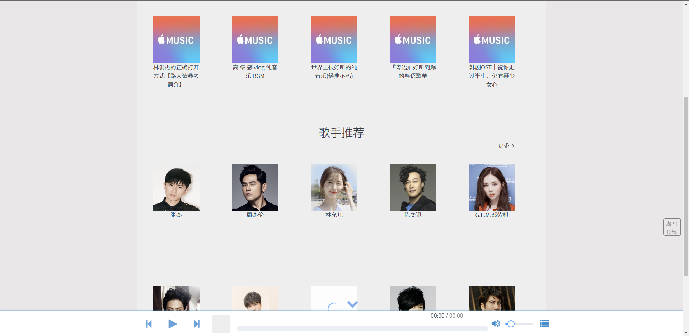

# vue2-music

**关于项目**

​    本项目是是基于Vue 2 和SpringBoot开发的一个简易音乐网站。

​    前端主要使用了原生JavaScript、Vue.js，使用了多个Module管理组件状态，使用AXIOS进行前后端数据交互，以及使用SCSS对CSS文件进行预编译，同时使用了前端流行的UI库之一的ElemenUI和图标字体库FontAwesome对网站进行美化。

​    后端主要使用了SpringBoot框架、Mybatis框架、MySQL数据库。网站后台能够管理用户、音乐、歌单、歌手数据, 用户能够检索音乐、歌单、歌手并能播放、收藏音乐。


项目展示





## Project setup

```
npm install
```

### Compiles and hot-reloads for development
```
npm run serve
```

### Compiles and minifies for production
```
npm run build
```

### Lints and fixes files
```
npm run lint
```

### vue router
```
npm install vue-router@
```

### vuex
```
npm install vuex@
```

### axios
```
npm install axios
```

### Customize configuration
See [Configuration Reference](https://cli.vuejs.org/config/).
