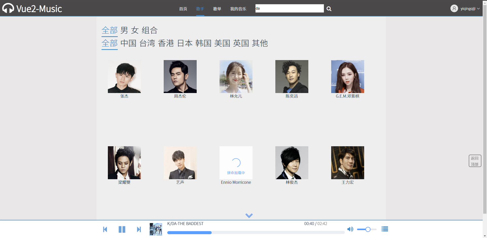

# vue2-music

##项目简介

​    本项目是是基于Vue 2 和SpringBoot2开发的一个简易音乐网站。

​	使用Vue 2及SpringBoot 2框架开发了一个前后端分离的简易音乐网站，用户能够检索歌手及音乐，播放音乐，能够创建、收藏歌单，网站后台能够管理用户、音乐、歌单、歌手数据。

+ 前端主要使用了原生 JavaScript、Vue.js ，使用Axios进行异步请求，以及使用了ElemenUI库并用SCSS 预编译CSS。
+  后端主要使用了SpringBoot 2框架、Mybatis框架、MySQL数据库。


##项目展示

###网站前台

####首页


####检索所有歌手




####检索所有歌单


####歌单详情页


####未登录-我的音乐


####已登录-我的音乐


####播放列表


###网站后台
####后台登录


#### 用户管理


####歌手管理


####歌手-歌曲管理


####歌单管理


####歌单-歌曲管理


##环境依赖

###前端

```text
###环境依赖###
├── @babel/core@7.20.7
├── @babel/eslint-parser@7.19.1
├── @vue/cli-plugin-babel@5.0.8
├── @vue/cli-plugin-eslint@5.0.8
├── @vue/cli-service@5.0.8
├── axios@1.2.2
├── core-js@3.27.1
├── element-ui@2.15.12
├── eslint-plugin-vue@8.7.1
├── eslint@7.32.0
├── font-awesome@4.7.0
├── node-sass@8.0.0
├── sass-loader@13.2.0
├── vue-router@3.6.5
├── vue-template-compiler@2.7.14
├── vue@2.7.14
└── vuex@3.6.2
```

### 后端

见`pom.xml`


##部署步骤

1. 克隆

```sh
git clone https://gitee.com/zetiny/vue2-music.git
```

2. 安装前端所需依赖 `npm install`

3. 启动前端服务 `npm run serve`
4. 执行SQL脚本 vue_spring.sql

4. 修改后端配置文件 `application-dev.yaml`

​		数据库名、端口号、用户名、密码

5. 使用maven引入依赖
6. 启动项目


##目录结构

### vue-music-project 后端

```text
### vue-music-manage
├─.idea
├─.mvn
├─img //上传的图片
│  ├─consumer-img //用户图片
│  ├─singer-img //歌手图片
│  ├─song-img //歌曲封面
│  └─song-list-img //歌单封面
├─song //上传的歌曲
├─src
│  ├─main
│  │  ├─java
│  │  │  └─top
│  │  │      └─zetiny
│  │  │          └─vuemusicproject
│  │  │              ├─bean //属性类
│  │  │              ├─config //配置类
│  │  │              ├─controller //业务
│  │  │              ├─dao //持久化
│  │  │              ├─enums //枚举类，未使用
│  │  │              ├─service //服务实现类及其接口
│  │  │              │  └─impl 
│  │  │              └─utils //工具类
│  │  └─resources
│  │      ├─mapper //MyBatis映射文件
│  │      ├─static //静态资源
│  │      │  ├─css
│  │      │  └─img
│  │      │      └─singer-img
│  │      └─templates
│  └─test
└─target
```


###vue-music-manage 网站后台

```text
### vue-music-manage
├─node_modules
├─public
└─src
    ├─api //前端数据请求接口
    │  ├─affiliation //歌单-歌手关
    │  ├─consumer //用户
    │  ├─infopage //首页
    │  ├─singer //歌手
    │  ├─song //歌曲
    │  └─song-list //歌单
    ├─assets //静态资源目录
    │  ├─css
    │  ├─img
    │  └─js
    ├─components //Vue组件
    │  └─common //公共组件
    ├─mixins //混入
    ├─pages //路由组件
    ├─plugins //插件
    ├─router //路由
    ├─store //状态管理
    └─utils //工具类
```


###vue-music-client 网站前台

```text
### vue-music-manage
├─node_modules
├─public
└─src
    ├─api //前端数据请求接口
    ├─assets  //静态资源目录
    │  ├─img
    │  ├─js
    │  │  └─data
    │  └─scss 
    ├─components //Vue组件
    │  ├─common //公共组件
    │  └─search //搜索组件
    ├─mixins //混入
    ├─pages  //路由组件
    ├─router //路由
    ├─store //状态管理
    └─utils //工具类
```


##**许可证**

Licensed under the  [Apache License](http://www.apache.org/licenses/), Version 2.0, January 2004. 


##其他

Happy Coding Everyday!

Email: 2463270717@qq.com
